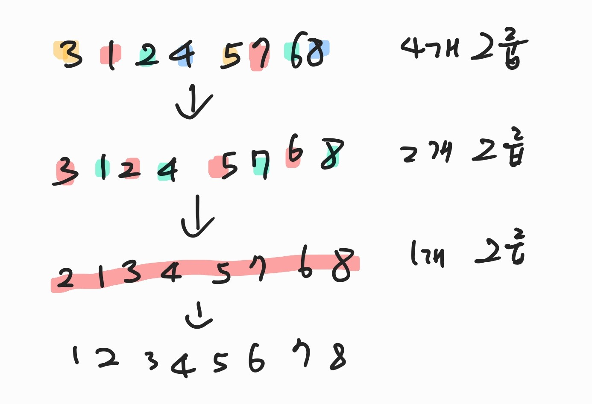

< Do it! 자료구조와 함께 배우는 알고리즘 입문 자바 편 >

## 정렬
> 어떠한 기준으로 데이터를 일정한 순서로 늘어서도록 바꾸는 작업

1. `내부 정렬` (main)
    - 정렬한 모든 데이터를 하나의 배열에 저장할 수 있는 경우에 사용
2. 외부 정렬
    - 정렬할 데이터가 너무 많아서 하나의 배열에 저장할 수 없는 경우에 사용

### 버블정렬
1. 맨 뒤에 두개의 요소 `N-2` `N-1`를 비교 하여 작은 것을 앞으로(앞부터 하든 뒤부터 하든 순서는 상관 없음)
2. `Index 0`까지 비교 하면서 가장 작은 요소가 앞으로 오게 한다.
3. 그 다음 정렬은 `index 0`을 제외한 그 다음 요소 `index 1`까지 비교를 실행한다.
4. 끝까지 반복

- 처음엔 비교횟수가 `n-1회` 그 다음 `n-2회`~~~ 반복
```java
void Bubblesort(int[] data, int n){
    int temp = 0;
    for(int i = 0; i < n - 1; i++){ // n-1인 이유는 이미 맨 끝에는 가장 큰 값이 오므로
        for(int j = n - 1; j > i; j--){ // i번째 까지는 정렬됐으므로 탐색 x
            if(data[j] < data[j-1]){
                temp = data[j-1];
                data[j-1] = data[j];
                data[j] = temp;
            }
        }
    }
}
```

> k-패스동안 k개의 요소가 정렬 되므로 k-1패스면 모든 요소가 다 정렬이 된다.

> 총 비교 횟수는 n-1 + n-2 + ~~~~ + 1 = n(n-1) / 2

#### 버블정렬 알고리즘 개선 1
- data[j] < data[j-1]의 조건이 성립 되지 않아 데이터 교환이 일어나지 않았고 패스가 지나갔다면 `break`문을 사용해 버블정렬을 멈추도록 한다.
```java
void Bubblesort(int[] data, int n){
    int temp = 0;
    for(int i = 0; i < n - 1; i++){ // n-1인 이유는 이미 맨 끝에는 가장 큰 값이 오므로
    int exchg = 0; // 교환이 일어났는지 확인하는 변수
        for(int j = n - 1; j > i; j--){ // i번째 까지는 정렬됐으므로 탐색 x
            if(data[j] < data[j-1]){
                temp = data[j-1];
                data[j-1] = data[j];
                data[j] = temp;
                exchg++;
                }
            }
            if(exchg == 0){
                break;
        }
    }
}
```

#### 버블정렬 알고리즘 개선 2
- 하나의 패스에서 어떤 index 이후로 데이터 교환이 일어나지 않았다면 해당 index로부터 0번 index까지는 이미 정렬이 되어 있는 상태이므로 다음 패스에서 해당 index까지만 탐색하도록 한다.
```java
void Bubblesort(int[] data, int n){
    int temp = 0;
    int k = 0;
    while(k < n - 1){
        int last = n - 1;
        for(int j = n - 1; j > k; j--){ // i번째 까지는 정렬됐으므로 탐색 x
            if(data[j] < data[j-1]){
                temp = data[j-1];
                data[j-1] = data[j];
                data[j] = temp;
                last = j;
            }
        }
        k = last;
    }
}
```

### 선택정렬
> 배열에서 가장 작은 원소를 찾아 앞에서부터 교환

```java
static void selectionSort(int[] a, int n){
    for(int i = 0; i < n; i++){
        int min = i;
        for(int j = i + 1; j < n; j++){
            if(a[j] < a[min]){
                min = j;
            }
        }
        swap(a, i, min);
    }
}
```
> 요소 비교 횟수는 n(n-1) / 2

### 삽입정렬
> 배열에서 두번째 원소부터 알맞은 위치에 삽입

```java
static void insertionSort(int[] a, int n){
    for(int i = 0; i < n; i++){
        int j;
        int tmp = a[i];
        for(j = i; j > 0 && a[j - 1] > tmp; j--){
            a[j] = a[j - 1];
        }
        a[j] = tmp;
    }
}
```
> 요소 비교 횟수는 n^2 / 2

### 셸정렬
> 삽입정렬을 보완한 정렬

- 삽입정렬 장점: 정렬을 마쳤거나 정렬을 마친 상태에 가까우면 정렬 속도가 매우 빨라짐
- 삽입정렬 단점: 삽입할 위치가 멀리 떨어져 있으면 이동해야 하는 횟수가 많아짐

 과정

- 그룹화 해서 정렬
> 4번 2번 1번 총 7번만에 정렬 완료
> 정렬 해야하는 횟수는 늘지만 요소 이동의 횟수는 줄어든다.

```java
static void shellSort(int[] a, int n){
    for(int h = n / 2; h > 0; h /= 2){
        for(int i = h; i < n; i++){
            int j;
            int tmp = a[i];
            for(j = i - h; j >= 0 && a[j] > tmp; j -= h){
                a[j + h] = a[j];
            }
            a[j + h] = tmp;
        }
    }
}
```
> 시간 복잡도 = O(n^1.25)

### 퀵정렬
> Pl 피벗 PR 하나의 기준값(피벗)을 정하고 두 개의 커서를 작동시켜서 정렬
> 분할 정복 알고리즘

- 배열 정렬 하는 작업
1. PL은 배열 맨 왼쪽부터 시작해서 피벗값보다 큰 값을 찾을때까지 오른쪽으로 스캔
2. PR은 배열 맨 오른쪽부터 시작해서 피벗값보다 작은 값을 찾을때까지 왼쪽으로 스캔
3. 해당 값을 찾으면 PL과 PR의 값을 바꿔준다.
4. PL과 PR이 교차하게 되면 종료

퀵 정렬 알고리즘은 교차한 후에 PR쪽과 PL을 분할한다.

- 재귀이용
```java
static void quickSort(int[] a, int left, int right){
    int pl = left;
    int pr = right;
    int x = a[(pl + pr) / 2];

    do{
        while(a[pl] < x) pl++;
        while(a[pr] > x) pr--;
        if(pl <= pr)
            swap(a, pl++, pr--);
    }while(pl <= pr);

    if(left < pr) quickSort(a, left, pr);
    if(pl < right) quickSort(a, pl, right);
}
```
추가

### 병합정렬
> 배열을 앞부분과 뒷부분으로 나누어 각각 정렬한 다음 병합하는 작업을 반복

```java
static void merge(int[] a, int na, int[] b, int nb, int[] c){
    int pa = 0;
    int pb = 0;
    int pc = 0;

    while(pa < na && pb < nb){ // 작은 값을 저장
        c[pc++] = (a[pa] <= b[pb]) ? a[pa++] : b[pb++];
    }
    while(pa < na){ // a에 남아있는 요소를 복사
        c[pc++] = a[pa++];
    }
    while(pb < nb){ // b에 남아있는 요소를 복사
        c[pc++] = b[pb++];
    }
}
```

- 병합 정렬 알고리즘
    1. 배열의 앞부분을 병합 정렬로 정렬
    2. 배열의 뒷부분을 병합 정렬로 정렬
    3. 배열의 앞부분과 뒷부분을 병합

- 시간복잡도
    - 분할 단계는 비교연산, 이동연산이 수행되지 않으므로 시간복잡도에 포함x
    - 병합 단계만 포함
> 배열 병합: O(n)이고 요소 개수가 n개일 때 병합 정렬의 단계는 log n 만큼 필요하므로 전체 시간 복잡도는 O(log n)