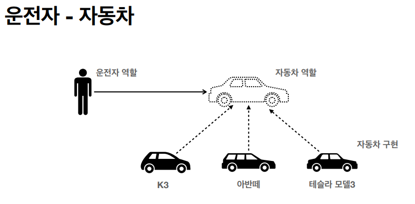
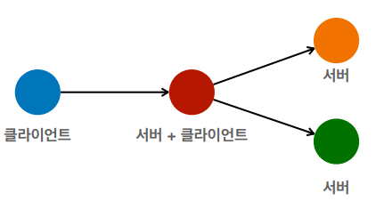
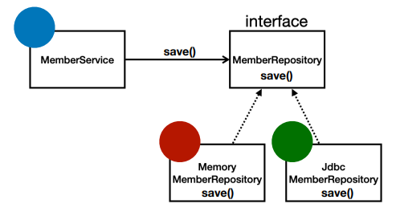

인프런 강의 < [스프링 핵심 원리 - 기본편](https://www.inflearn.com/course/%EC%8A%A4%ED%94%84%EB%A7%81-%ED%95%B5%EC%8B%AC-%EC%9B%90%EB%A6%AC-%EA%B8%B0%EB%B3%B8%ED%8E%B8/dashboard) > 정리

---

## 좋은 객체 지향 프로그래밍이란?

### 다형성(Polymorphism)
- 역할(인터페이스) and 구현으로 세상을 구분한다.



설명
- 운전자(클라이언트)는 차가 바뀌어도 탈 수 있다.
- 운전자는 자동차 역할(인터페이스)만 안다.
- 운전자는 자동차(내부)에 대해서 알 필요가 없다.

결론
- 새로운 자동차, 기능이 나와도 클라이언트를 바꿀 필요가 없다.
- **역할과 구현을 구분했기 때문에 가능**

**강의 자료 정리**
- 역할과 구현으로 구분하면 세상이 단순해지고, 유연해지며 변경도 편리해진다.
- 클라이언트는 대상의 역할(인터페이스)만 알면 된다.
- 클라이언트는 구현 대상의 내부 구조를 몰라도 된다.
- 클라이언트는 구현 대상의 내부 구조가 변경되어도 영향을 받지 않는다.
- 클라이언트는 구현 대상 자체를 변경해도 영향을 받지 않는다.

### 역할과 구현
- 역할: 인터페이스
- 구현: 인터페이스를 구현한 클래스, 객체
- 역할을 먼저 설계, 그 다음 객체 설계

### 클라이언트와 서버

- 클라이언트: 요청
- 서버: 응답



### 다형성 - 오버라이딩


- 오버라이딩 된 메소드 실행
    - 위 그림에서 Memory, Jdbc중에 하나가 선택되어 실행

```java
public class MemberService {
    1. private MemberRepository memberRepository = new MemoryMemberRepository();
    2. private MemberRepository memberRepository = new JdbcMemberRepository();
}
```

#### 다형성의 본질
- 인터페이스를 구현한 객체 인스턴스를 실행 시점에 유연하게 변경할 수 있다.
- 클라이언트를 변경하지 않고, 서버의 구현 기능을 유연하게 변경할 수 있다.

