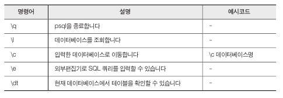
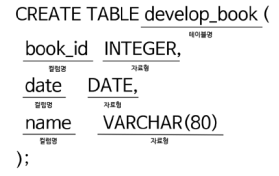
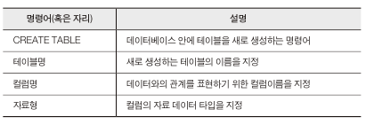

< 모두를 위한 PostgreSQL >을 공부하고 정리 했습니다. 

---

## SQL Shell 명령어


## 데이터베이스 생성
```sql
CREATE DATABASE book_store;
```
- `book_store`라는 데이터베이스 생성
- `\l` 명령어를 이용해서 생성한 데이터베이스 조회 가능
- `\c book_store` 명령어를 이용해서 생성한 데이터베이슬 접속
- 접속이 되면 `book_store=#` 으로 나옴

## 데이터베이스 삭제
```sql
DROP DATABASE 데이터베이스명;
```
- 현재 접속중인 데이터베이스는 삭제할 수 없다.

## 테이블 생성



- VARCHAR(80)은 80자 이하의 문자의 형태를 의미한다.

## 테이블 삭제
```sql
DROP TABLE 테이블명;
```
